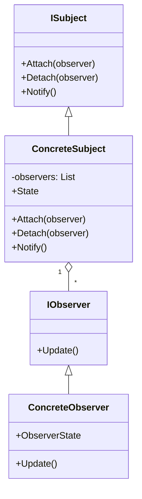

---
# Proyecto Comportamiento

Este documento describe el proceso para crear una solución .NET que implementa el patrón de diseño de comportamiento **Observer**.

## Paso a paso

1. **Crear la solución y los proyectos:**
   - Crear la solución:
     ```sh
     dotnet new sln -o Comportamiento
     ```
   - Crear el proyecto de dominio:
     ```sh
     dotnet new classlib -n Comportamiento.Domain -o Comportamiento/Comportamiento.Domain
     ```
   - Crear el proyecto de pruebas:
     ```sh
     dotnet new nunit -n Comportamiento.Domain.Tests -o Comportamiento/Comportamiento.Domain.Tests
     ```
   - Agregar los proyectos a la solución:
     ```sh
     dotnet sln Comportamiento/Comportamiento.sln add Comportamiento/Comportamiento.Domain/Comportamiento.Domain.csproj
     dotnet sln Comportamiento/Comportamiento.sln add Comportamiento/Comportamiento.Domain.Tests/Comportamiento.Domain.Tests.csproj
     ```

2. **Implementar el patrón Observer en el proyecto de dominio:**
   - Crear las interfaces y clases necesarias para el patrón Observer.

3. **Agregar pruebas unitarias en el proyecto de pruebas:**
   - Verificar el funcionamiento del patrón Observer.

## Diagrama Mermaid



## Ejemplo de código

```csharp
using Comportamiento.Domain;

var subject = new ConcreteSubject();
var observer1 = new ConcreteObserver();
var observer2 = new ConcreteObserver();

subject.Attach(observer1);
subject.Attach(observer2);

subject.Notify("Notificación 1");

Console.WriteLine(observer1.ObserverState); // Notificación 1
Console.WriteLine(observer2.ObserverState); // Notificación 1

subject.Detach(observer1);
subject.Notify("Notificación 2");

Console.WriteLine(observer1.ObserverState); // Notificación 1
Console.WriteLine(observer2.ObserverState); // Notificación 2
```

## Referencias
- [Patrón Observer - Refactoring Guru](https://refactoring.guru/es/design-patterns/observer)
